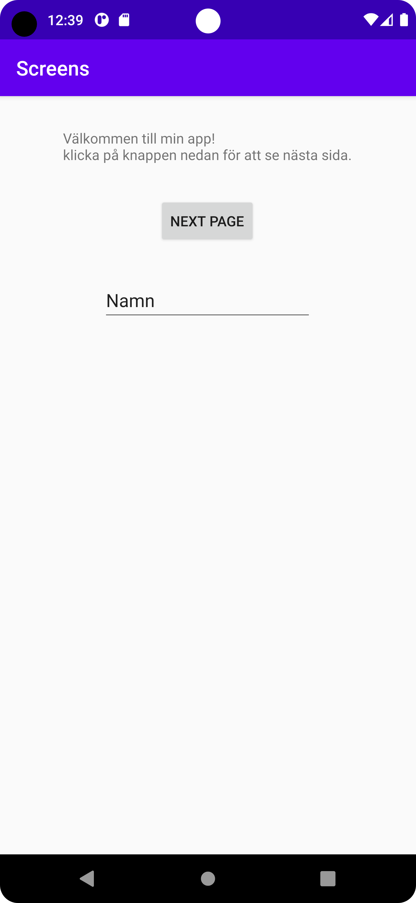
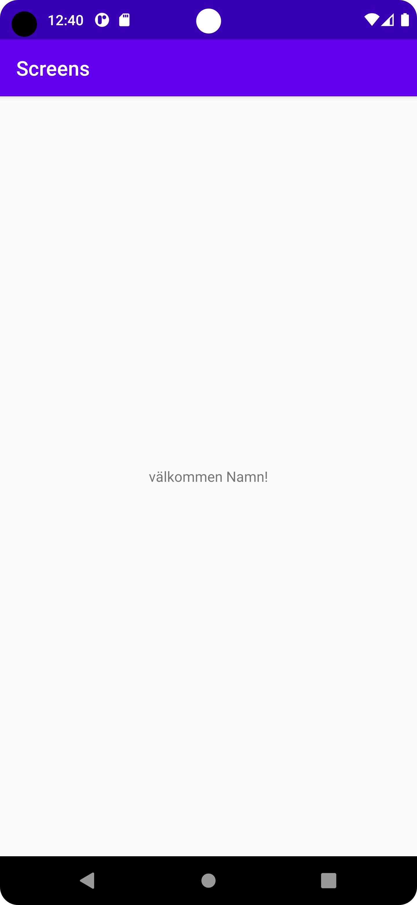

# Rapport

**Assignment 4**

_Activities and intents_.

- Jag började med att skapa en ny activity, eftersom jag inte bestämmt mig för vad appen ska göra än, fick denna heta MainActivity2.
- Därefter lades en knapp till i MainActivity 1. Denna knappen ska kunna transportera användaren till MainActivity 2. Detta uppnås genom nedan kod:
```
button.setOnClickListener(new View.OnClickListener() {
    @Override
    public void onClick(View view) {
        Intent intent = new Intent(MainActivity.this, MainActivity2.class);
        MainActivity.this.startActivity(intent);
    }
});
```
- I koden ovan definieras först en ny intent; ett meddelande att byta från nuvarande Activity till nästa.
- Därefter Skapades en EditText i MainActivity1 där användaren kan skriva in sitt namn.
- För att denna data ska kunna transporteras in i MainActivity2 användes extras på följande sätt:
```
EditText editText = findViewById(R.id.editTextTextPersonName);
String name = String.valueOf(editText.getText());
intent.putExtra("Name", name);
```
- Först hittas texten, sedan tas texten ut ur EditText och konvereras till en String. Därpå läggs namnet in i intenten med identifieraren Name.
- För att sedan kunna läsa denna data i MainActivity2 hämtas den intent som tog oss dit. 
- Därefter hittas namnet genom koden: 
```
Intent intent = getIntent();
String name = intent.getStringExtra("Name");
TextView textview = findViewById(R.id.textView2);
textview.setText("välkommen " + name + "!");
```
**Slutresultat:**
 